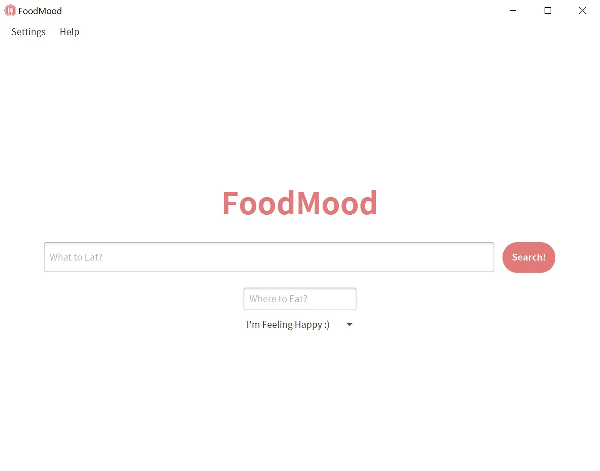

# FoodMood
Clone the project directory. FoodMood can be launched in three ways:
1. Set up your `$JAVAFX_HOME` path and run the jar file using [run.sh](out/artifacts/project_jar/run.sh)
2. `cd` into the project root and run the app using `mvn clean javafx:jlink`
3. Run the [Main.java](src/main/java/com/foodmood/Main.java) file directly in your terminal/IDE

The search page will open up on launch.

  

Set up your preferences and search for anything! Yum!  

  

