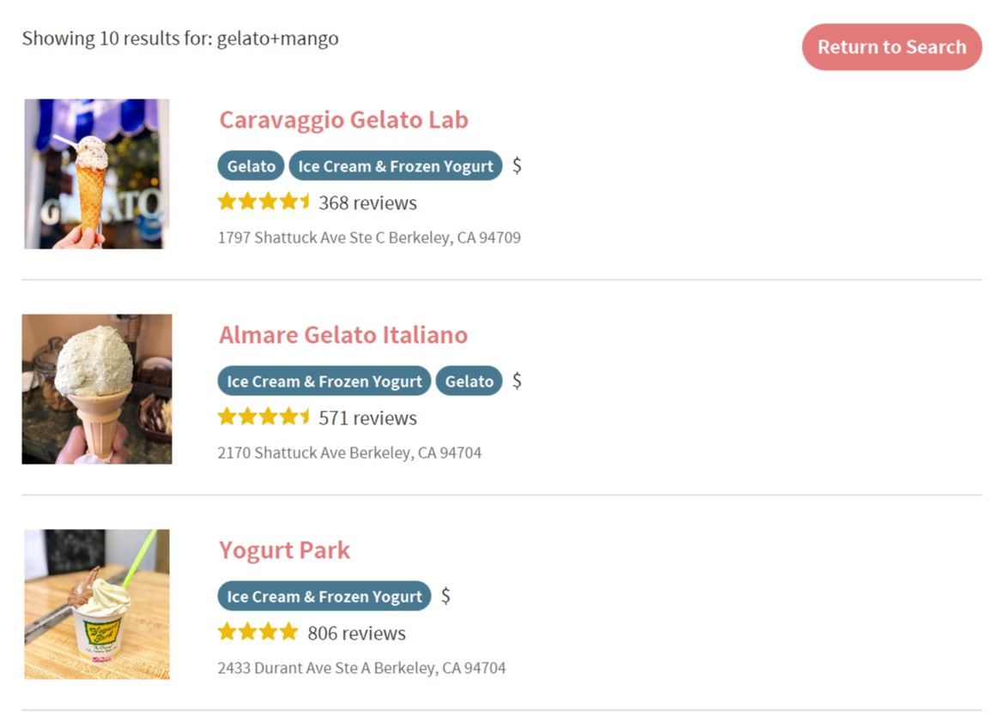

# FoodMood
Clone the project directory. FoodMood can be launched in three ways:
1. Set up your `$JAVAFX_HOME` path and run the jar file using [run.sh](out/artifacts/project_jar/run.sh)
2. `cd` into the project root and run the app using `mvn clean javafx:jlink`
3. Run the [Main.java](src/main/java/com/foodmood/Main.java) file directly in your terminal/IDE

Before running the app, you will also need to create an `env.java` file for environment variables. A Yelp API Key is required for FoodMood to work, documentations can be found [here](https://www.yelp.com/developers/documentation/v3/authentication). I initially used [java-dotenv](https://github.com/cdimascio/java-dotenv) for managing .env, but it seems that jlink currently does not support automodules such as java-dotenv. After acquiring an API Key, paste the code below to your `env.java`.  
`package com.foodmood;

public class env {
	public static String YELP_API_KEY = "GYzoN6QbzdXq89k6JzOSQl6iyEhlfSUD9XBB-chNfLMGNy5cAjdlf1WzvDtvbPZ0P-wtP5xMKqypilkJnUGfeuAkUR1V9x1uJ3nqSxeCf2RFWAQmuZeNn1wtnmv4X3Yx";
}
`

The search page will open up on launch.

  

Set up your preferences and search for anything! Yum!  

  

